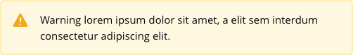

Alerts are embedded (inline) within the content of a page or experience. They should only be used to communicate content level related messages. They are persistent and cannot be explicitly dismissed by the user, unless an error with an available resolution. For full usage guides and documentation, click here.

> Alerts help notify users of the state or information related to a page or a contained experience. They should be
> thoughtfully placed and should contextually supplement or be relevant to users in regards to its surrounding
> experience.



```js
function helloWorld() {
  console.log("Hello World!")
}
```
