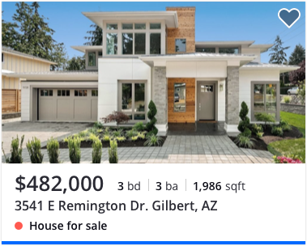

Cards are basic, flexible containers used to house different types of information.

The simplest card containers display grouped content, similar concepts, and actions. (Also referred to as modules)

## List Cards

List cards are a crucial part of the ‘home triage’ and Search experience. This is the first step users take in deciding if this is ‘the home’ for them. A clear and un-cluttered card allows for easy decision making an minimizes cognitive load.

## Card Templates

These list cards may be used to explore other variations that deviate from original list cards.